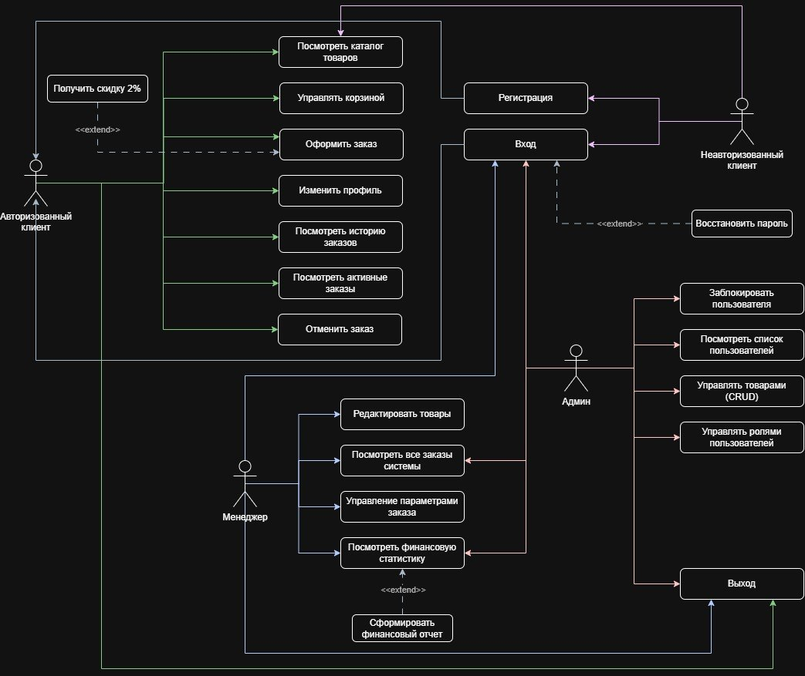

### *Задача: Показать, какие пользователи работают в системе и какие действия они могут выполнять*.

### *Обязательно должно быть минимум 3 роли: Клиент Менеджер Администратор*.

Моя задача как аналитика:
1. Определить Сущности и Бизнес-правила
2. Определить пользователей системы
3. Построить Use-Case Диаграмму

### *Описание предметной области*

Вы являетесь сотрудником коммерческого отдела компании, продающей различные товары через Интернет.
Вашей задачей является отслеживание финансовой составляющей ее работы.
Работа компании организована следующим образом: на Интернет сайте представлены (выставлены на продажу) некоторые товары.
Каждый из них имеет некоторое название, цену и единицу измерения (штуки, килограммы, литры).
Для проведения исследований и оптимизации работы магазина вы пытаетесь собирать данные с клиентов.
При этом для вас определяющее значение имеют стандартные анкетные данные, а также телефон и адрес электронной почты для связи.
В случае приобретения товаров на сумму свыше 5000р, клиент переходит в категорию постоянных и получает скидку на каждую покупку в размере 2%.
По каждому факту продажи вы автоматически фиксируете клиента, товары, количество, дату продажи, дату доставки. 

### ***Определить сущности и Бизнес-правила***

## **Сущности:**

1. Клиент:
ID клиента;
ФИО;
Телефон;
Email;
Статус постоянного клиента.

2. Товар:
ID товара;
Название;
Цена;
Единица измерения;
Описание;
Остаток на складе.

3. Заказ:
ID заказа;
Дата создания;
Статус;
Общая стоимость;
ID клиента.

4. Состав Заказа (Нужна для реализации Бизнес-правила - Клиент может оформить заказ на один или несколько разных товаров.):
ID позиции;
ID заказа;
ID товара;
Количество;
Цена на момент покупки.

5. Доставка:
ID доставки;
Адрес доставки;
Дата доставки;
Статус доставки;
ID заказа.

6. Продажа:
ID продажи;
Дата продажи;
Сумма продажи;
ID клиента;
ID заказа.

8. Отзыв:
ID отзыва;
Текст;
Оценка;
Дата;
Клиент;
Товар.

9. Оплата:
ID оплаты;
ID заказа;
Способ оплаты;
Сумма;
Статус оплаты.

## **Бизнес-правила:**
1. Цена товара не может быть отрицательной.
2. Количество товара в заказе должно быть больше нуля.
3. Сумма заказа определяется ценой товара и его количеством.
4. Каждый заказ связан с конкретным клиентом.
5. Каждый заказ содержит хотя бы один товар.
6. Для каждого заказа фиксируются даты продажи и доставки.
7. Клиент становится постоянным при сумме покупок более 5000 руб.
8. Постоянный клиент получает скидку 2%.
9. Каждый клиент имеет уникальную учетную запись(ФИО, телефон, электронная почта).
10. Клиент может оформить заказ на один или несколько разных товаров.
11. Для каждого товара хранятся название, цена и единица измерения.
12. Заказ может иметь один из 4-x статусов: «Создан», «Доставляется», «Доставлен», «Отменен».

## **Функциональные требования**
1. Система должна обеспечивать регистрацию и авторизацию клиентов.
2. Система должна автоматически рассчитывать сумму заказа.
3. Система должна предоставлять возможность выбора способа оплаты.
4. Система должна предоставлять возможность выбора способа и адреса доставки.
5. Система должна вести историю покупок клиентов.
6. Система должна автоматически определять постоянных клиентов.
7. Система должна автоматически применять скидку постоянного клиента.
8. Система должна сохранять информацию о продажах.
9. Система должна предоставлять менеджеру доступ к заказам и клиентам.
10. Система должна предоставлять администратору возможность управления каталогом товаров.
11. Система должна предоставлять возможность отмены заказа до момента его отправки.
12. Система должна хранить и обеспечивать управление учетными записями клиентов.
13. Система должна позволять добавлять в заказ несколько товаров.
14. Система должна обеспечивать хранение и редактирование данных о товарах.
15. Система должна поддерживать изменение и отображение статуса заказа.

# ***Определить пользователей системы*** 

## **Клиент**:

### **Неавторизованный Клиент: **(Пользователь посещает интернет-магазин без входа в учетную запись)
Просматривать каталог товаров;
Искать товары;
Фильтровать и сортировать товары;
Просматривать информацию о товаре;
Просматривать цены и наличие товаров;
Читать отзывы и рейтинги;
Добавлять товары в корзину;
Регистрироваться;
Авторизоваться.

### **Авторизованный Клиент: **(Пользователь вошел в свою учетную запись)
Наследует все возможности неавторизованного клиента, а также может:
Управлять личным профилем;
Изменять адрес доставки;
Управлять корзиной;
Выбирать способ оплаты;
Оформлять заказ;
Отслеживать статус заказа;
Отменять заказ до момента отправки;
Просматривать историю о совершенных покупках;
Оставлять отзывы на товары;
Получать скидку постоянного клиента.

## **Менеджер:**
Просматривать заказы;
Подтверждать заказы;
Оформлять доставку;
Просматривать клиентов;
Просматривать продажи;
Формировать отчеты.

## **Администратор:**
Добавлять товары;
Редактировать товары;
Удалять товары;
Управлять пользователями;
Управлять скидками;
Просматривать статистику системы.

# ***Построить Use-Case Диаграмму***

## **Use-Case Диаграмма**

[Use-Case](Use-Case.jpg)

Клиент
│
├─ Неавторизованный клиент
│   │
│   ├─ Просмотр каталога
│   ├─ Поиск товаров
│   ├─ Просмотр карточки товара
│   ├─ Добавление товара в корзину
│   ├─ Регистрация
│   └─ Авторизация
│
└─ Авторизованный клиент
    │
    ├─ Оформление заказа
    ├─ Управление корзиной
    ├─ Просмотр истории заказов
    ├─ Отслеживание доставки
    ├─ Управление профилем
    ├─ Оставление отзывов
    └─ Получение скидки постоянного клиента

Менеджер
│
├─ Просмотр заказов
├─ Подтверждение заказа
├─ Оформление доставки
├─ Просмотр клиентов
└─ Формирование отчетов

Администратор
│
├─ Управление товарами
├─ Управление пользователями
├─ Управление скидками
└─ Просмотр статистики

## ***Примеры Use Case***

### **Use Case: Оформление заказа**

Исполнитель: Авторизованный клиент

Предусловие: Клиент авторизован в системе.

Основной сценарий:
Клиент выбирает товары.
Добавляет товары в корзину.
Переходит к оформлению заказа.
Указывает адрес доставки.
Выбирает способ доставки.
Выбирает способ оплаты.
Подтверждает заказ.
Система рассчитывает итоговую стоимость.
Система создает заказ.

Результат:
Заказ успешно создан и получает статус «Создан».

### **Use Case: Регистрация клиента**
Исполнитель: Неавторизованный клиент

Предусловие: Пользователь не имеет учетной записи или не вошел в систему.

Основной сценарий:
Пользователь открывает страницу регистрации.
Вводит ФИО.
Вводит номер телефона.
Вводит адрес электронной почты.
Создает пароль.
Подтверждает регистрацию.
Система проверяет корректность данных.
Система создает учетную запись клиента.

Результат:
Клиент зарегистрирован и может авторизоваться в системе.

## ***Результат который есть у команды***
1. Описание предметной области интернет-магазина.
2. Список пользователей системы.
3. Функциональные требования.
4. Бизнес-правила.
5. Несколько текстовых Use Case.
6. Use-Case диаграмма.

## Use-Case диаграмму можно посмотреть в вложении под названием Use-Case.jpg